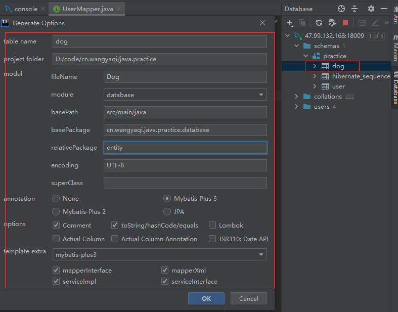

# MyBatis-Plus
## 资料
* [官网](https://mp.baomidou.com/guide/quick-start.html), [所有注解](https://mp.baomidou.com/guide/annotation.html#tablename)
* [MyBatis与MyBatis-plus的区别](https://www.jianshu.com/p/8556c8468241)
* [使用示例](https://www.cnblogs.com/l-y-h/p/12859477.html)
* [官方示例](https://gitee.com/baomidou/mybatis-plus-samples)

## 代码生成文件
* [自定义代码生成器【推荐】](https://gitee.com/qiya365/longquan/code.generator) : 参数详见jar包里的示例，[资料1](https://mp.baomidou.com/guide/generator.html), [资料2](https://juejin.cn/post/6844904190683119629)
* [插件代码生成器](https://mp.baomidou.com/guide/mybatisx-idea-plugin.html) ， 

* 模板使用和开发
    * 模板文件：
    * 启用方法：templateConfig.setController("templates/controller.java.vm");

### 代码生成SQL函数
* https://mp.baomidou.com/guide/mybatisx-idea-plugin.html，生成查询等

## 开发
* 表对象类含有：创建时间，更新时间，逻辑删除

## 注意事项
* SQL尽量都在service写，不要写mapper。join的没法子只能写到mapper
* 多租户的联表查询：每个表要有租户编号，sql里每个表都要给别名
